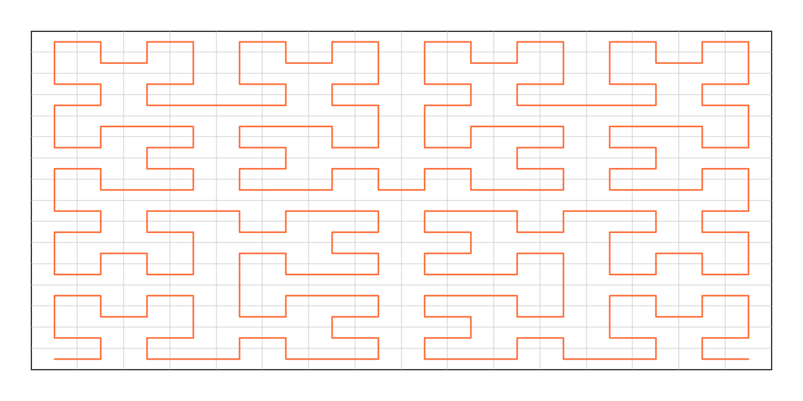

# AABB - Hilbert R-tree Spatial Index
[](https://crates.io/crates/aabb)
[](https://docs.rs/aabb)
[](https://opensource.org/licenses/MIT)


A Rust library providing efficient Hilbert R-tree implementation for spatial queries on axis-aligned bounding boxes (AABBs).

## Features

- **Hilbert Curve Ordering**: Uses Hilbert space-filling curve for improved spatial locality (inspired by [Flatbush](https://github.com/mourner/flatbush) algorithm)
- **AABB Intersection Queries**: Fast rectangular bounding box intersection testing
- **Zero-Copy**: Single contiguous buffer layout - safe for parallel queries with no allocations per query
- **Simple API**: Easy to use with minimal setup
- **Static Optimization**: Efficient for static or infrequently-modified spatial data

## Usage

Add this to your `Cargo.toml`:

```toml
[dependencies]
aabb = "0.7"
```

### Basic Example

```rust
use aabb::prelude::*;

fn main() {
    let mut tree = AABB::with_capacity(3);
    
    // Add bounding boxes (min_x, min_y, max_x, max_y)
    tree.add(0.0, 0.0, 1.0, 1.0);
    tree.add(0.5, 0.5, 1.5, 1.5);
    tree.add(2.0, 2.0, 3.0, 3.0);
    
    // Build the spatial index
    tree.build();
    
    // Query for intersecting boxes
    let mut results = Vec::new();
    // bbox: xmin, ymin, xmax, ymax 
    tree.query_intersecting(0.7, 0.7, 1.3, 1.3, &mut results);
    
    println!("Found {} intersecting boxes", results.len());
    // Results contains indices of boxes that intersect the query
}
```

### Point Cloud Example

```rust
use aabb::prelude::*;

fn main() {
    let mut tree = AABB::with_capacity(4);
    
    // Add points using the convenient add_point() method
    tree.add_point(0.0, 0.0);
    tree.add_point(1.0, 1.0);
    tree.add_point(2.0, 2.0);
    tree.add_point(5.0, 5.0);
    
    // Build the spatial index
    tree.build();
    
    // Query for points within a circular region (optimized for point data)
    let mut results = Vec::new();
    tree.query_circle_points(0.0, 0.0, 2.5, &mut results);
    
    println!("Found {} points within radius 2.5", results.len());
    
    // Find K nearest points
    let mut results = Vec::new();
    tree.query_nearest_k_points(0.0, 0.0, 2, &mut results);
    println!("Found {} nearest points", results.len());
}
```

## How it Works

The Hilbert R-tree stores bounding boxes in a flat array and sorts them by their Hilbert curve index (computed from box centers). This provides good spatial locality for most spatial queries while maintaining a simple, cache-friendly data structure.

### Hilbert Curve Spatial Ordering

The Hilbert space-filling curve is a continuous fractal curve that visits every cell in a 2D grid exactly once, maintaining proximity in space:



The curve preserves spatial locality - points close to each other in 2D space tend to be close along the Hilbert curve order. This property makes the flat array layout extremely cache-friendly for spatial queries.


## API Reference

### Construction
- `HilbertRTree::new()` or `AABB::new()` - Create a new empty tree
- `HilbertRTree::with_capacity(capacity)` or `AABB::with_capacity(capacity)` - Create a new tree with preallocated capacity
- `HilbertRTreeI32::new()` or `AABBI32::new()` - Create a new empty tree
- `HilbertRTreeI32::with_capacity(capacity)` or `AABBI32::with_capacity(capacity)` - Create a new tree with preallocated capacity
- `add(min_x, min_y, max_x, max_y)` - `(f64, i32)` Add a bounding box
- `add_point(x, y)` - `(f64)` Add a point (convenience method - internally stores as (x, y, x, y))
- `build()` - `(f64, i32)` Build the spatial index (required before querying)
- `get(item_id)` - `(f64, i32)` Retrieve the bounding box for an item by its ID
- `get_point(item_id)` - `(f64)` Retrieve a point as (x, y) for items added with `add_point()`
- `save(path)` - `(f64, i32)` Save the built tree to a file for fast loading later
- `load(path)` - `(f64, i32)` Load a previously saved tree from a file

### Queries

#### Basic Spatial Queries
- `query_intersecting(min_x, min_y, max_x, max_y, results)` `(f64, i32)` - Find boxes that intersect a rectangle
- `query_intersecting_id(item_id, results)` `(f64, i32)` - Find boxes that intersect with a specific item already in the tree (by ID), excluding the item itself
- `query_intersecting_k(min_x, min_y, max_x, max_y, k, results)` `(f64, i32)` - Find first K intersecting boxes
- `query_point(x, y, results)` `(f64, i32)` - Find boxes that contain a point
- `query_contain(min_x, min_y, max_x, max_y, results)` `(f64, i32)` - Find boxes that contain a rectangle
- `query_contained_within(min_x, min_y, max_x, max_y, results)` `(f64, i32)` - Find boxes contained within a rectangle

#### Distance-Based Queries
- `query_nearest_k(x, y, k, results)` `(f64)` - Find K nearest boxes to a point
- `query_circle(center_x, center_y, radius, results)` `(f64)` - Find boxes intersecting a circular region

#### Point-Specific Optimized Queries
- `query_nearest_k_points(x, y, k, results)` `(f64)` - Find K nearest points (stored as (x, x, y, y)), sorted by distance
- `query_circle_points(center_x, center_y, radius, results)` `(f64)` - Find points within a circular region (optimized for point data)

**Note:** Point-specific methods assume all items in the tree are stored as degenerate boxes (points) where `min_x == max_x` and `min_y == max_y`. For mixed data (both points and boxes), use the general methods instead.

#### Directional Queries
- `query_in_direction(rect_min_x, rect_min_y, rect_max_x, rect_max_y, direction_x, direction_y, distance, results)` `(f64)` - Find boxes intersecting a rectangle's movement path
- `query_in_direction_k(rect_min_x, rect_min_y, rect_max_x, rect_max_y, direction_x, direction_y, k, distance, results)` `(f64)` - Find K nearest boxes intersecting a rectangle's movement path

## Examples

Minimal examples for each query method are available in the `examples/` directory:

- `query_intersecting` - Find boxes intersecting a rectangle
- `query_intersecting_id` - Find boxes intersecting a specific item already in the tree (by ID)
- `query_intersecting_k` - Find K first intersecting boxes
- `query_point` - Find boxes containing a point
- `query_contain` - Find boxes containing a rectangle
- `query_contained_within` - Find boxes inside a rectangle
- `query_nearest_k` - Find K nearest boxes
- `query_circle` - Find boxes in a circular region
- `query_circle_points` - Find points in a circular region (optimized)
- `query_nearest_k_points` - Find K nearest points (optimized)
- `query_in_direction` - Find boxes in a movement path
- `query_in_direction_k` - Find K nearest in a movement path

Run any example with:
```bash
cargo run --example query_point
```

## Performance

- **Cache-Friendly**: Flat array storage with Hilbert curve ordering for good spatial locality
- **Static Optimization**: Optimized for static or infrequently-modified spatial data

```
Environment:
- OS: Ubuntu 24.04.3 LTS
- Processor: Intel Core i5-1240P
- Kernel: Linux 6.8.0-86-generic 
- CPU Frequency: ~1773-3500 MHz
> cargo bench --bench profile_bench
> cargo bench --bench profile_bench_i32

Box Tree Queries (f64)
================
build box tree 1000000 items:        76.65ms
query_intersecting (100% coverage) - 1000 queries:     2390.735µs/query
query_intersecting (50% coverage)  - 1000 queries:      436.450µs/query
query_intersecting (10% coverage)  - 1000 queries:       98.460µs/query
query_intersecting (1% coverage)   - 1000 queries:       17.832µs/query
query_intersecting (0.01% coverage)- 1000 queries:        2.668µs/query
query_nearest_k (1000 searches of 100 neighbors):        13.868µs/query
query_nearest_k (1 search of 1000000 neighbors):        110.456ms/query
query_nearest_k (100000 searches of 1 neighbor):          5.297µs/query
query_nearest_k k=1 - 1000 queries:          6.315µs/query
query_nearest_k k=10 - 1000 queries:         6.580µs/query
query_nearest_k k=100 - 1000 queries:       13.783µs/query
query_nearest_k k=1000 - 100 queries:       86.150µs/query
query_point - 10000 queries:                       1.083µs/query
query_intersecting_k k=100 - 10000 queries:        1.886µs/query
query_contain - 1000 queries:                      2.027µs/query
query_contained_within - 1000 queries:             2.947µs/query
query_circle - 1000 queries (radius=5):          49.666µs/query
query_in_direction - 1000 queries:               13.243µs/query
query_in_direction_k k=50 - 1000 queries:        20.865µs/query

Point Cloud Queries
===================
build point cloud 1000000 points:                  71.33ms
query_circle_points - 1000 queries (radius=5):     30.001µs/query
query_nearest_k_points k=1 - 1000 queries:          2.955µs/query
query_nearest_k_points k=10 - 1000 queries:         4.333µs/query
query_nearest_k_points k=100 - 1000 queries:       12.038µs/query
query_nearest_k_points k=1000 - 100 queries:       76.387µs/query


Box Tree Queries (i32)
================
build box tree 1000000 items:        55.19ms
query_intersecting (100% coverage) - 1000 queries:     1676.877µs/query
query_intersecting (50% coverage)  - 1000 queries:      262.290µs/query
query_intersecting (50% coverage)  - 1000 queries:       55.554µs/query
query_intersecting (1% coverage)   - 1000 queries:        7.253µs/query
query_intersecting (0.01% coverage)- 1000 queries:        0.768µs/query
query_intersecting_k k=100 - 10000 queries:               0.564µs/query
query_point - 10000 queries:                  0.449µs/query
query_contain - 1000 queries:                 0.279µs/query
query_contained_within - 1000 queries:        1.604µs/query
query_intersecting_id - 1000 queries:         0.307µs/query

```


## Related Projects

AABB is part of the open-sourced [Nest2D](https://nest2d.com) projects collection.
